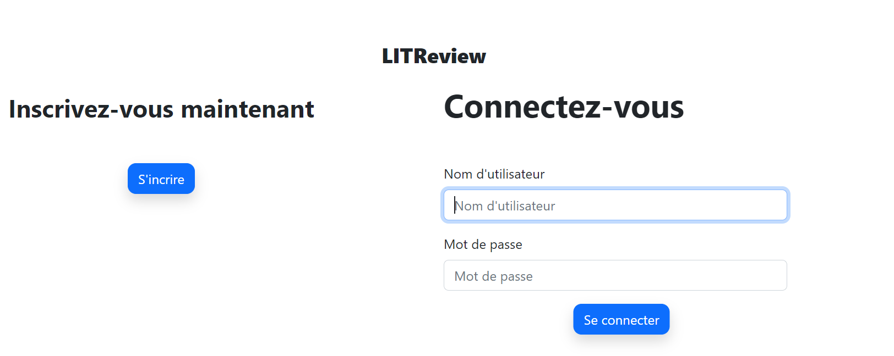

# OpenClassrooms: Projet 9 - Développez une application Web en utilisant Django 



Projet réalisé dans le cadre de la formation OpenClassrooms Développeur d'Applications Python.
Il s'agit d'une application web "MVC" réalisée avec Django.
L'application LitReviews, est un réseau social permettant de demander et poster des critiques de livres.

## Spécifications technique 

- Se connecter et s’inscrire – le site ne doit pas être accessible à un utilisateur
non connecté.

- Consulter un flux contenant les derniers tickets et les commentaires des
utilisateurs qu'il suit, classés par ordre chronologique, les plus récents en
premier.

- Créer de nouveaux tickets pour demander une critique sur un livre/article.

- Créer des critiques en réponse à des tickets.

- Créer des critiques qui ne sont pas en réponse à un ticket. Dans le cadre d'un
processus en une étape, l'utilisateur créera un ticket puis un commentaire en
réponse à son propre ticket.

- Voir, modifier et supprimer ses propres tickets et commentaires.

- Suivre les autres utilisateurs en entrant leur nom d'utilisateur.

- Voir qui il suit et suivre qui il veut ;cesser de suivre un utilisateur.


## Installation

Pour commencer, assurez-vous d'avoir Python installé sur votre système.

Ensuite, suivez ces étapes pour installer et exécuter le programme :

1. Clonez ce dépôt dans le répertoire de votre choix en utilisant la commande suivante :
    
    ```bash
    git clone https://github.com/Anthony-landry/P9-LITReview.git
    ```
    
2. Accédez au dossier P4-ChessTournaments.
    
3. Créez un nouvel environnement virtuel en utilisant la commande suivante :
    
    ```bash
    python -m venv env
    ```
    
4. Activez l'environnement virtuel :
    
    * Sur Windows :
        
        ```bash
        env\Scripts\activate.bat
        ```
        
    * Sur Linux :
        
        ```bash
        source env/bin/activate
        ```
        
5. Installez les packages requis en exécutant la commande suivante :
    
    ```bash
    pip install -r requirements.txt
    ```
    
6. placez vous à la racine du projet (là ou se trouve le fichier manage.py), puis effectuez les migrations :
    
    ```bash
    python manage.py makemigrations
    ```

    Puis,

    ```bash
    python manage.py migrate
    ```

7. Vous pouvez maintenant lancer le script principal avec la commande :
    
    ```bash
    python manage.py runserver
    ```

8. Vous pouvez ensuite utiliser l'applicaton à l'adresse suivante:
    
    ```bash
    http://127.0.0.1:8000/
    ```

# Utilisation

## Django administration

Identifiant : **Admin** | Mot de passe : **abcd.1234!**

→ http://127.0.0.1:8000/admin/


## les différents utilisateurs enregistrés

| *Identifiant* | *Mot de passe* |
|---------------|----------------|
| Anthony       | jL3^%So8E46>   |
| Emma          | &L&SwP42=hU0   |
| Arnaud        | 8Iz!'eH@rs41   |
| elodie        | V\|o9d89M@Ua{  |
| hugo          | f>L8Q,f2*95R   |
| pauline       | 78.l1R;:yJiT   |
| louis         | 74}tc5U4Sc5:   |
| elisa         | pN1p3^7G2=0_   |